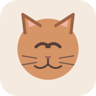
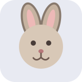
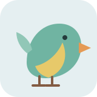
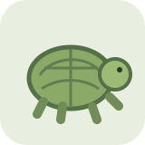

# Mina djur

Webbapp för att hålla koll på katter och smådjur: vikt, kloklippning,
veterinärbesök, medicin, vaccinationer, avmaskning, pälsvård, hälsodagbok
och egna anteckningar. Varje djur har en egen profilsida med bilder,
privata dokument, utgifter och möjlighet att dela åtkomst med andra
användarkonton. Layouten anpassar sig efter mobiltelefoner, surfplattor
och större skärmar.

## Superenkel installation

Krav: Linux-server med Git, Docker Engine och Docker Compose v2. Kopiera och
kör de här tre raderna i serverns terminal:

```bash
git clone https://github.com/richardstenlund/mina-djur.git
cd mina-djur
bash install.sh
```

Klart! Installationsskriptet skapar automatiskt unika, starka hemligheter,
frågar vilken port du vill använda (tryck Enter för standardport `4300`),
skapar `.env`, bygger appen och startar databasen och webbsidan.

Öppna sedan `http://SERVERNS-IP:4300` (byt till den port du valde) och skapa
ett konto på registreringssidan. Om sidan inte öppnas, kontrollera att
porten är tillåten i serverns brandvägg. Om porten redan används, välj en
annan när installationsskriptet frågar.

Skriptet skriver aldrig över en befintlig `.env`. För att uppdatera en redan
installerad app använder du:

```bash
cd mina-djur
git pull
docker compose up -d --build
```

Databasen samt uppladdade bilder och dokument sparas i Docker-volymer även
när appen byggs om. Spara `.env` säkert — den innehåller lösenord och sessionshemlighet.
Ta inte bort Docker-volymerna om du vill behålla dina data.

Om något går fel kan du visa apploggen med:

```bash
docker compose logs --tail=100 app
```

> **Säkerhet:** För åtkomst utanför hemnätverket, använd en HTTPS-reverse proxy
> (t.ex. Caddy, Nginx eller Traefik) och sätt `COOKIE_SECURE=true` i `.env`.
> Öppna inte tjänsten mot internet via okrypterad HTTP. För lokal HTTP-åtkomst
> ska `COOKIE_SECURE=false` stå kvar.

### Exempelbilder

Här är några av illustrationerna som visas i appen innan du laddar upp egna
foton:

| Katt | Hund | Kanin | Fågel | Sköldpadda |
|---|---|---|---|---|
|  |  |  |  |  |

Databasen (Postgres) körs i en egen container med en Docker-volym
(`db_data`) så att all data — användare, djur och anteckningar — sparas
mellan omstarter och uppdateringar. Uppladdade bilder och dokument sparas i
en egen volym (`uploads_data`) så de också finns kvar efter en omstart eller
uppdatering.

## Djurprofiler och bilder

Klicka på "Öppna profil" på ett djur för att komma till dess egen sida.
Där kan du:

- ladda upp bilder (JPEG, PNG, WEBP eller GIF, max 8 MB per bild),
- ta bort bilder,
- uppdatera namn, djurart, födelsedatum, kön, kastreringsstatus, startvikt
  och övrig information,
- välja eller skriva in ras/variant; förslagen anpassas efter vald djurart,
- spara uppfödare samt namn, färg/teckning och hårlag för far och mor,
- fylla i allergier/specialbehov, chipnummer, veterinärklinik med
  telefonnummer, försäkringsbolag och försäkringsnummer,
- ange foderschema (typ, mängd och hur ofta),
- lägga till och ta bort skötselanteckningar precis som på startsidan,
- dokumentera diagnos, behandling och uppföljningsdatum vid veterinärbesök,
- föra hälsodagbok med symtom, aptit och humör,
- hålla och uppdatera en medicinlista med dos, frekvens, behandlingsdatum
  och nästa dos; tydliga påminnelser visar om dosen är försenad, infaller
  idag eller närmar sig,
- registrera utgifter med datum, kategori, belopp och anteckning samt se
  den sammanlagda kostnaden,
- ladda upp, hämta och ta bort privata dokument som journaler och kvitton,
- dela djurprofilen med en annan användares konto och återkalla åtkomst;
  endast profilens ägare kan hantera delningen,
- se en graf över viktutvecklingen över tid,
- exportera hela skötselhistoriken som en CSV-fil (öppningsbar i Excel).

Personer som fått delad åtkomst kan använda djurets funktioner och se dess
uppgifter. Dokument och övrigt innehåll hanteras från respektive djurprofil.

Den första uppladdade bilden visas som "omslagsbild" på djurets kort på
startsidan. Innan du laddar upp en egen bild visas en lokal exempelillustration
för djurarten. Originalillustrationerna ligger i
[`app/public/images/examples`](./app/public/images/examples) och laddas från
projektet utan externa bildtjänster.

Djurartslistan innehåller bland annat hund, gerbil, chinchilla, degu,
iller, igelkott, sköldpadda, ödla, orm och fisk. Välj "Annat" om du har
en djurart som inte finns med i listan.
Rasförslag visas för varje listad djurart, och egna raser/varianter kan
skrivas in fritt.

## Påminnelser

Varje djur får automatiska påminnelser för kloklippning (standard var
30:e dag), vaccination (standard var 365:e dag) och avmaskning (standard
var 90:e dag), baserat på den senast loggade anteckningen av respektive
typ. Är ett datum nära eller passerat visas en varningsbricka både på
djurets profilsida och som liten badge på djurkortet på startsidan. Du
kan ändra intervallet per djur och påminnelsetyp direkt på profilsidan.

## Uppdatera appen


```powershell
cd mina-djur
git pull
docker compose up -d --build
```

Databasens schema uppdateras automatiskt när appen startar.

## Säkerhetskopiering

Skripten `backup.sh` och `restore.sh` tar hand om både databasen och
uppladdade filer (bilder och dokument) i ett enda kommando, och fungerar
på en vanlig Linux-server med Docker:

```bash
./backup.sh
```

Det skapar två filer i mappen `backups/`, t.ex.
`backups/db-20260101-030000.sql.gz` och `backups/uploads-20260101-030000.tar.gz`.
Säkerhetskopior äldre än 30 dagar rensas automatiskt bort. Kopiera gärna
`backups/`-mappen till en annan plats också (annan server, molnlagring eller
liknande) – en kopia på samma disk skyddar inte mot diskhaveri.

Kör backupen automatiskt varje natt med cron:

```bash
crontab -e
```

```
0 3 * * * /sökväg/till/mina-djur/backup.sh >> /sökväg/till/mina-djur/backups/backup.log 2>&1
```

Vid behov återställer du en säkerhetskopia (skriver över nuvarande data,
frågar om bekräftelse):

```bash
./restore.sh backups/db-20260101-030000.sql.gz backups/uploads-20260101-030000.tar.gz
```

Om du hellre vill göra det manuellt:

```powershell
docker compose exec db pg_dump -U minadjur minadjur > backup.sql
```

Databasdumpen innehåller uppgifter och dokumentmetadata, men inte själva
bilagorna. Säkerhetskopiera även Docker-volymen `uploads_data` för att bevara
djurens bilder och uppladdade dokument.

## Utveckling utan Docker (valfritt)

```powershell
cd app
npm install
$env:PGHOST = "localhost"
$env:PGPORT = "5432"
$env:PGUSER = "minadjur"
$env:PGPASSWORD = "losenord"
$env:PGDATABASE = "minadjur"
$env:SESSION_SECRET = "en-lang-hemlighet"
npm start
```

Kräver en lokalt körande Postgres-databas med schemat från
`app/db/init.sql` inläst.

## Struktur

- `app/server.js` – Express-server, sessioner (lagras i Postgres via
  `connect-pg-simple`), säkerhetsheaders.
- `app/routes/auth.js` – registrering, inloggning, utloggning.
- `app/routes/animals.js` – API för djur och deras historik och bilder,
  alltid filtrerat på inloggad användares `user_id` så att ingen kan se
  någon annans djur.
- `app/db/init.sql` – databasschema som körs automatiskt vid varje
  serverstart (säkert eftersom det bara skapar saker som inte redan
  finns).
- `app/public/` – frontend (login, registrering, huvudsidan och
  djurprofilsidan).
